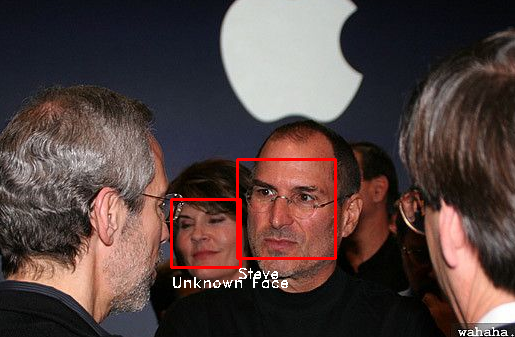
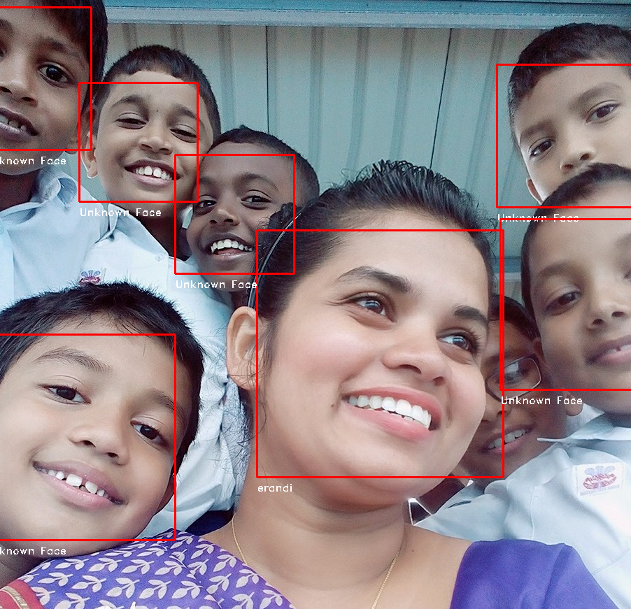
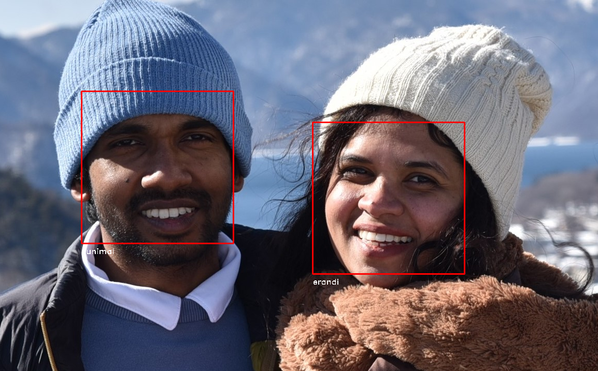
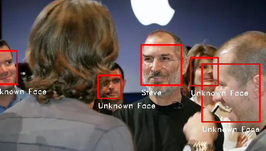

# faceRec

How to Run


# Create a virtual environment
python -m venv venv

# Activate the virtual environment ( Windows)
> .\venv\Scripts\Activate.bat

> pip install -r requirements.txt


Code:


# Face Recognition and Annotation Application

This repository contains a Python application that performs face recognition and annotates faces in test images by comparing them with a set of known face encodings.

---

## 📋 Features
- Encode multiple images of known individuals into face encodings.
- Detect and encode faces in test images.
- Compare detected faces in test images with known face encodings.
- Annotate test images with rectangles around detected faces and display their names.

---

## ⚙️ Requirements
- Python 3.x
- Libraries:
  - [`opencv-python`](https://pypi.org/project/opencv-python/): For image processing and annotation.
  - [`face_recognition`](https://pypi.org/project/face-recognition/): For face detection and recognition.
  - [`numpy`](https://pypi.org/project/numpy/): For numerical operations.
  - [`dlib`](http://dlib.net/): Dlib is a modern C++ toolkit containing machine learning algorithms .

Install dependencies using the provided `requirements.txt`:
```bash
pip install -r requirements.txt
```

---

## 📂 Directory Structure
```
project/
│
├── samples/               # Folder containing images of known individuals
│   ├── trump.jpg
│   ├── erandi.jpg
│   ├── sunimal.jpg
│   └── ... (other sample images)
│
├── testImages/            # Folder containing images for testing recognition
│   ├── test.jpg
│   ├── test1.jpg
│   └── ... (other test images)
│
├── venv/                  # Virtual environment for the project
│   └── ... (environment files)
│
├── image-faceRec-multiOutPut.py   # Script for multi-output face recognition
├── image-facerec.py                # Main face recognition script
├── image-faceRecMulti.py           # Another variation of face recognition script
├── README.md              # Project description and documentation
└── requirements.txt       # List of Python dependencies

```

---

## 🚀 How to Run

1. **Clone the Repository**
   ```bash
   git clone https://github.com/yourusername/face-recognition-annotation.git
   cd face-recognition-annotation
   ```

2. **Install Dependencies**
   ```bash
   pip install -r requirements.txt
   ```

3. **Run the Script**
   ```bash
   python image-faceRec-multiOutPut.py
   ```

4. **View Results**
   - Annotated test images will appear in a window.
   - Close each window to see the next test image.

---

## 🛠️ How It Works

### 1. Encoding Known Faces
- Images of known individuals (e.g., Trump, Erandi, Sunimal, Steve) are loaded.
- Face encodings are extracted and stored in `known_face_encodings`.
- Each individual's name is associated with their encodings in `known_face_names`.

### 2. Processing Test Images
- Test images are loaded one by one from the `testImages` directory.
- Faces in each test image are detected, and their encodings are computed.

### 3. Matching and Annotation
- Detected faces are compared with known face encodings using:
  ```python
  face_recognition.compare_faces(known_face_encodings, current_face_encoding, tolerance=0.5)
  ```
- The best match is identified, and test images are annotated with:
  - A rectangle around the face.
  - The name of the matched individual (or "Unknown Face" if no match is found).

### 4. Displaying Results
- Annotated images are displayed using OpenCV.

---

## 🖼️ Customization

1. Add more known individuals by placing their images in the `samples/` directory and updating the corresponding lists in the script:
   ```python
   erandi_images = ['samples/erandi.jpg', 'samples/erandi1.jpg']
   erandi_encodings = encode_images(erandi_images)
   ```

2. Adjust `tolerance` in `face_recognition.compare_faces()` to fine-tune matching sensitivity:
   ```python
   matches = face_recognition.compare_faces(known_face_encodings, current_face_encoding, tolerance=0.5)
   ```

---

## 📜 License
This project is licensed under the [MIT License](LICENSE).

---
## 📜 OUT PUT











---
## 📧 Contact
For any questions or feedback, feel free to open an issue or contact me at [sunimal@loollablk.com](mailto:loollablk@gmail.com).